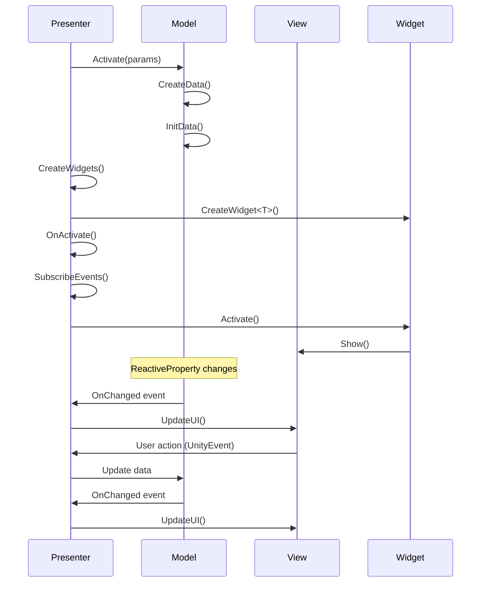

# MVP Framework

**MVP Framework for Unity** — architectural pattern Model-View-Presenter with support for reactive properties, widgets, and event system.

---

## 📖 Table of Contents

- [Core Concepts](#-core-concepts)
- [Architecture](#%EF%B8%8F-architecture)
- [Framework Components](#-framework-components)
  - [Presenter](#presenter)
  - [View](#view)
  - [Model](#model)
  - [Widgets](#widgets)
  - [Reactive Properties](#reactive-properties)
  - [Events System](#events-system)
- [Usage](#-usage)
- [Lifecycle](#-lifecycle)
- [Project Structure Recommendations](#-project-structure-recommendations)
- [Installation](#-installation)

---

## 🎯 Core Concepts

MVP Framework separates application logic into three main layers:

- **Model** — stores and manages screen data
- **View** — displays UI and handles user input (MonoBehaviour)
- **Presenter** — connects Model and View, manages business logic

### Key Features

✅ **Reactive Properties** — automatic UI updates when data changes  
✅ **Widgets** — reusable UI components without own model  
✅ **Composite Widgets** — containers for other widgets  
✅ **Event System** — centralized subscription management  
✅ **Object Pooling** — widget pooling support  
✅ **Dependency Injection** — Zenject/DI-Tools integration

---

## 🏗️ Architecture


---

## 🧩 Framework Components

### Presenter

**PresenterBase<TView, TModel, TScreenType>** — base class for all presenters.

#### Core Methods

| Method | Description |
|--------|-------------|
| `Activate()` | Activates screen and all its widgets |
| `Deactivate()` | Deactivates screen and clears subscriptions |
| `Hide()` | Hides screen without deactivation |
| `CreateWidgets()` | Creates screen widgets (override) |
| `OnActivate()` | Called on activation (override) |
| `OnDeactivate()` | Called on deactivation (override) |
| `OnBindWidgets()` | Bind widgets to data (override) |

#### Widget Management

```csharp
// Create widget
protected T CreateWidget<T>(IWidgetProps props = null, bool manual = false);

// Create widget from pool
protected T SpawnWidget<T>(IWidgetProps props = null);

// Remove widget
protected void RemoveWidget(IWidget widget);
protected void DespawnWidget(IWidget widget);
```

#### Event Subscription

```csharp
// UnityEvent
SubscribeEvent(this, view.OnButtonClicked, HandleButtonClick);

// UnityEvent<T>
SubscribeEvent<int>(this, view.OnValueChanged, HandleValueChanged);

// Standard C# Events (Auto-unsubscribed on Deactivate)
SubscribeEvent(
    () => service.OnChanged += HandleChanged,
    () => service.OnChanged -= HandleChanged
);

// Signal (requires SignalsHub)
SubscribeSignal<MySignal>(HandleSignal);
```

---

### View

**ScreenView** — base class for screen views (MonoBehaviour).

#### Core Methods

| Method | Description |
|--------|-------------|
| `Show()` | Shows screen (sets active) |
| `Hide()` | Hides screen |
| `OnActivate()` | Called on show (override) |
| `OnDeactivate()` | Called on hide (override) |

#### Components

- `Canvas` — screen canvas
- `GraphicRaycaster` — UI event handler

---

### Model

**ModelBase<TData>** — base class for data models.

#### Core Methods

| Method | Description |
|--------|-------------|
| `Activate(IScreenParams)` | Initializes model when screen opens |
| `Deactivate()` | Cleanup when screen closes |
| `InitData()` | Initialize data (override) |
| `CreateData()` | Create data object (override) |

#### Properties

- `Data` — model data (type `TData`)
- `OpenParams` — screen opening parameters

---

### Widgets

#### WidgetBase<TView, TData>

Base class for widgets — reusable UI components.

| Method | Description |
|--------|-------------|
| `Bind(TView, TData)` | Bind widget to view and data |
| `Activate()` | Activate widget |
| `Deactivate()` | Deactivate widget |
| `Rebind(TData)` | Update widget data |
| `SetProps(IWidgetProps)` | Set widget properties |

**Key Features:**
- Widgets **do not have** their own model
- Used for reusable UI components
- Support manual lifecycle management (`IsManualLifecycleMode`)

#### CompositeWidget<TView, TData>

Container widget for other widgets.

```csharp
protected T CreateWidget<T>(IWidgetProps props = null);
protected T SpawnWidget<T>(IWidgetProps props = null);
protected void RemoveChildControl(IWidget widget);
protected virtual void CreateWidgets(); // Override to create child widgets
```

#### IPoolableWidget

Interface for widgets supporting pooling.

```csharp
public class MyPoolableWidget : WidgetBase<MyView, MyData>, IPoolableWidget
{
    // Used via SpawnWidget/Despawn
}
```

---

### Reactive Properties

#### ReactiveProperty<T>

Reactive property for automatic UI updates.

```csharp
public class MyModel : ModelBase<MyData>
{
    public ReactiveProperty<int> Score = new ReactiveProperty<int>(0);
    public ReactiveProperty<string> PlayerName = new ReactiveProperty<string>();
}
```

**Core Methods and Events:**

| Member | Description |
|--------|-------------|
| `Value` | Get/set value (triggers OnChanged) |
| `OnChanged` | Event fired on value change |
| `OnBeforeValueChanged` | Event before change (old, new value) |
| `SetSilently(T)` | Set value without events |
| `Touch()` | Manually invoke OnChanged with current value |
| `Reset()` | Reset to default and clear subscriptions |
| `Select<TOut>(Func)` | Create derived property |
| `Where(Func)` | Filter changes |

**Usage Examples:**

```csharp
// Basic usage
score.OnChanged.AddListener(newValue => Debug.Log($"Score: {newValue}"));
score.Value = 100; // Triggers event

// Derived property
var isHighScore = score.Select(s => s > 100);
isHighScore.OnChanged.AddListener(isHigh => scoreText.color = isHigh ? Color.gold : Color.white);

// Conditional updates
var positiveScore = score.Where(s => s > 0);
```

---

#### CompositeReactiveProperty<T1, T2>

Combines multiple reactive properties into one event. When any source property changes, `OnChanged` fires with all current values.

**Available Overloads:**
- `CompositeReactiveProperty<T1, T2>` — 2 properties
- `CompositeReactiveProperty<T1, T2, T3>` — 3 properties
- `CompositeReactiveProperty<T1, T2, T3, T4>` — 4 properties

**Real Example from WayPointProgressData:**

```csharp
public class WayPointProgressData
{
    public WayPointProgressData()
    {
        // Combine Value and MaxValue into one composite
        ValueComposite = new CompositeReactiveProperty<int, int>(
            Value,
            MaxValue
        );
    }

    public ReactiveProperty<int> Value { get; set; } = new();
    public ReactiveProperty<int> MaxValue { get; set; } = new();
    public CompositeReactiveProperty<int, int> ValueComposite { get; set; }
}
```

**Usage in Widget:**

```csharp
// Subscribe to composite event - fires when Value OR MaxValue changes
SubscribeEvent(this, Data.ValueComposite.OnChanged, UpdateProgressBar);

private void UpdateProgressBar(int currentValue, int maxValue)
{
    progressBar.fillAmount = (float)currentValue / maxValue;
    progressText.text = $"{currentValue}/{maxValue}";
}
```

**Factory Method Example:**

```csharp
public class LevelStartPopupData
{
    public LevelStartPopupData()
    {
        // Using factory for cleaner syntax
        TowersAmountComposite = CompositeReactivePropertyFactory.Create(
            SelectedTowersCount, 
            MaxTowersAmount
        );
    }

    public ReactiveProperty<int> SelectedTowersCount { get; set; } = new();
    public ReactiveProperty<int> MaxTowersAmount { get; set; } = new();
    public CompositeReactiveProperty<int, int> TowersAmountComposite { get; set; }
}
```

---

#### ConditionalCompositeReactiveProperty

Combines multiple reactive properties using boolean logic (AND/OR). Evaluates predicates and returns a single boolean result.

**Combination Modes:**
- `CombinationMode.Any` — OR logic (true if ANY condition is true)
- `CombinationMode.All` — AND logic (true if ALL conditions are true)

**Core Methods:**

| Method | Description |
|--------|-------------|
| `Add<T>(property, predicate)` | Add property with condition |
| `Remove<T>(property)` | Remove property from composition |
| `ClearAll()` | Remove all properties and unsubscribe |
| `Value` | Current boolean result (read-only) |
| `Mode` | Get/set combination mode (Any/All) |
| `OnResultChanged` | Event fired when result changes |

**Real Example from TechnologyCardWidgetData:**

```csharp
public class TechnologyCardWidgetData : IDisposable
{
    public ReactiveProperty<bool> IsPurchased { get; set; } = new();
    
    // Check if ALL previous cards have been purchased
    public ConditionalCompositeReactiveProperty HasAllPrevCardsBeenPurchased { get; set; } = new(true)
    {
        Mode = ConditionalCompositeReactiveProperty.CombinationMode.All,
    };

    public List<TechnologyCardWidgetData> PrevCards { get; set; } = new();

    public void Dispose()
    {
        HasAllPrevCardsBeenPurchased.ClearAll();
    }
}
```

**Usage in Model:**

```csharp
// Add each previous card's IsPurchased property
foreach (var prevCard in technologyCard.PrevCards)
{
    // Card is available if previous card is purchased
    technologyCard.HasAllPrevCardsBeenPurchased.Add(
        prevCard.IsPurchased, 
        isPurchased => isPurchased == true
    );
}

// Subscribe to result changes
SubscribeEvent(this, data.HasAllPrevCardsBeenPurchased.OnResultChanged, isAvailable =>
{
    // Enable/disable card based on whether all prerequisites are met
    view.SetInteractable(isAvailable);
});
```

**Additional Examples:**

```csharp
// OR logic example - any tower is selected
var anyTowerSelected = new ConditionalCompositeReactiveProperty(false)
{
    Mode = ConditionalCompositeReactiveProperty.CombinationMode.Any
};

anyTowerSelected.Add(tower1.IsSelected, selected => selected);
anyTowerSelected.Add(tower2.IsSelected, selected => selected);
anyTowerSelected.Add(tower3.IsSelected, selected => selected);

// Fires when at least one tower becomes selected
anyTowerSelected.OnResultChanged.AddListener(anySelected =>
{
    startButton.SetEnabled(anySelected);
});

// AND logic example - all resources are sufficient
var canAfford = new ConditionalCompositeReactiveProperty(true)
{
    Mode = ConditionalCompositeReactiveProperty.CombinationMode.All
};

canAfford.Add(goldAmount, gold => gold >= requiredGold);
canAfford.Add(gemsAmount, gems => gems >= requiredGems);
canAfford.Add(woodAmount, wood => wood >= requiredWood);

// Fires only when ALL resources are sufficient
canAfford.OnResultChanged.AddListener(affordable =>
{
    purchaseButton.SetEnabled(affordable);
});
```

---

#### ReactiveList<T>

Observable list that fires events when items are added or removed.

**Core Methods:**

| Method | Description |
|--------|-------------|
| `Add(item, silently)` | Add item to list |
| `Remove(item, silently)` | Remove specific item |
| `Remove(predicate, silently)` | Remove item matching predicate |
| `RemoveAll()` | Remove all items (fires events for each) |
| `Clear()` | Clear list without events |
| `Find(predicate)` | Find item matching predicate |
| `FindIndex(predicate)` | Find index of item |
| `Sort(comparer)` | Sort list |

**Properties:**

| Property | Description |
|----------|-------------|
| `Count` | Number of items |
| `OnItemAdded` | Event fired when item is added |
| `OnItemRemoved` | Event fired when item is removed |
| `[index]` | Access item by index |

**Real Example from LevelStartPopupData:**

```csharp
public class LevelStartPopupData
{
    // List of level modifiers
    public ReactiveList<LevelModifierWidgetData> Modifiers { get; set; } = new();
}
```

**Usage in Presenter:**

```csharp
protected override void SubscribeEvents()
{
    // React to modifiers being added
    SubscribeEvent(this, Model.Data.Modifiers.OnItemAdded, OnModifierAdded);
    
    // React to modifiers being removed
    SubscribeEvent(this, Model.Data.Modifiers.OnItemRemoved, OnModifierRemoved);
}

private void OnModifierAdded(LevelModifierWidgetData modifierData)
{
    // Spawn widget for new modifier
    var widget = SpawnWidget<LevelModifierWidget>();
    widget.Bind(View.GetNextModifierSlot(), modifierData);
}

private void OnModifierRemoved(LevelModifierWidgetData modifierData)
{
    // Find and despawn widget
    var widget = widgets.Find(w => w.Data == modifierData);
    DespawnWidget(widget);
}
```

**Example from TowerDescriptionData:**

```csharp
public class TowerDescriptionData
{
    public ReactiveProperty<LocalizedString> Description { get; set; } = new();
    
    // Dynamic parameters for localized string
    public ReactiveList<string> DescriptionParams { get; set; } = new();
}
```

**Usage:**

```csharp
// Update description when parameters change
SubscribeEvent(this, data.DescriptionParams.OnItemAdded, _ => UpdateDescription());
SubscribeEvent(this, data.DescriptionParams.OnItemRemoved, _ => UpdateDescription());

// Add/update parameters
data.DescriptionParams.Clear();
data.DescriptionParams.Add(damage.ToString());
data.DescriptionParams.Add(range.ToString());
data.DescriptionParams.Add(attackSpeed.ToString());

// Remove silently (no event)
data.DescriptionParams.Remove(oldParam, silently: true);
```

---

#### ReactiveTrigger

Simple event without data (inherits UnityEvent).

```csharp
public ReactiveTrigger OnLevelCompleted = new ReactiveTrigger();

// Usage
OnLevelCompleted.AddListener(() => Debug.Log("Level completed!"));
OnLevelCompleted.Invoke();
```

---

### Events System

**EventsStore** — centralized event subscription storage.

#### Core Methods

```csharp
// Subscribe to UnityEvent
eventsStore.SubscribeEvent(subscriber, unityEvent, handler);

// Subscribe to UnityEvent<T>
eventsStore.SubscribeEvent<int>(subscriber, unityEvent, handler);

// Subscribe to Signal
eventsStore.SubscribeSignal<MySignal>(subscriber, handler);

// Unsubscribe all subscriber events
eventsStore.Unsubscribe(subscriber);
```

**Benefits:**
- ✅ Automatic unsubscribe on deactivation
- ✅ No memory leaks
- ✅ Object pooling for subscribers

---

## 💻 Usage

### 1. Create Presenter

```csharp
using MVPFramework.Presenter;
using Signals;

public class ConfirmPresenter : PresenterBase<ConfirmView, ConfirmModel, MVPPopupType>
{
    private ButtonWidget okButton;
    private ButtonWidget cancelButton;

    public ConfirmPresenter(PresenterBaseArgs args, ConfirmModel model) : base(args, model) { }

    public override MVPPopupType Type => MVPPopupType.Confirm;

    protected override void OnActivate()
    {
        View.SetTerms(Model.Data.TitleTerm, Model.Data.DescriptionTerm);
        base.OnActivate();
    }

    protected override void CreateWidgets()
    {
        okButton = CreateWidget<ButtonWidget>();
        cancelButton = CreateWidget<ButtonWidget>();
    }

    protected override void OnBindWidgets()
    {
        var data = Model.Data;

        okButton.Bind(View.OkButton, data.OkButton);
        cancelButton.Bind(View.CancelButton, data.CancelButton);
    }

    protected override void SubscribeEvents()
    {
        var data = Model.Data;

        SubscribeEvent(this, data.OkButton.OnClick, OnOkButtonClick);
        SubscribeEvent(this, data.CancelButton.OnClick, OnCancelButtonClick);
        SubscribeEvent(this, View.OnCloseClick, OnCancelButtonClick);
    }

    private void OnCancelButtonClick()
    {
        SignalsHub.DispatchAsync(new ConfirmClosedSignal()
        {
            IsConfirmed = false,
        });

        View.Close();
    }

    private void OnOkButtonClick()
    {
        SignalsHub.DispatchAsync(new ConfirmClosedSignal()
        {
            IsConfirmed = true,
        });

        View.Close();
    }
}
```

### 2. Create View

```csharp
using MVPFramework.View;
using UnityEngine;
using UnityEngine.Localization;
using UnityEngine.Localization.Components;

public class ConfirmView : PopupView
{
    [SerializeField] private LocalizedString defaultTitleTerm;
    [SerializeField] private LocalizeStringEvent titleLocalize;
    [SerializeField] private LocalizeStringEvent descriptionLocalize;

    [field: SerializeField] public ButtonWidgetView OkButton { get; private set; }
    [field: SerializeField] public ButtonWidgetView CancelButton { get; private set; }

    public UnityEvent OnCloseClick { get; } = new();

    public void SetTerms(LocalizedString titleTerm, LocalizedString descriptionTerm)
    {
        titleLocalize.StringReference = titleTerm ?? defaultTitleTerm;
        descriptionLocalize.StringReference = descriptionTerm;
    }

    public void CloseClicked()
    {
        OnCloseClick.Invoke();
    }
}
```

### 3. Create Model

```csharp
using MVPFramework.Model;

public class ConfirmData
{
    public ButtonData OkButton { get; set; } = new();
    public ButtonData CancelButton { get; set; } = new();
    public LocalizedString TitleTerm { get; set; }
    public LocalizedString DescriptionTerm { get; set; }
}

public class ConfirmModel : ModelBase<ConfirmData>
{
    protected override void InitData()
    {
        var props = (ConfirmPopupParams)OpenParams;

        Data.TitleTerm = (Data.TitleTerm != null) ? props.TitleTerm : null;
        Data.DescriptionTerm = props.DescriptionTerm;
    }

    protected override ConfirmData CreateData()
    {
        return new ConfirmData();
    }
}
```

### 4. Create Widget

```csharp
using MVPFramework.Widgets;
using MVPFramework.Model;

public class ButtonData
{
    public ReactiveProperty<bool> IsEnabled { get; set; } = new(defaultValue: true);
    public ReactiveProperty<bool> IsHidden { get; set; } = new(defaultValue: false);
    public ReactiveTrigger OnClick { get; set; } = new();
}

public class ButtonWidget : WidgetBase<ButtonWidgetView, ButtonData>
{
    public ButtonWidget(WidgetBaseArgs args) : base(args) { }

    protected override void SubscribeEvents()
    {
        base.SubscribeEvents();

        SubscribeEvent(this, View.OnClick, OnClick);
        SubscribeEvent(this, Data.IsEnabled.OnChanged, View.SetEnabled);
        SubscribeEvent(this, Data.IsHidden.OnChanged, View.SetHidden);
    }

    private void OnClick()
    {
        if (!Data.IsEnabled.Value)
            return;

        Data.OnClick.Invoke();
    }
}

public class ButtonWidgetView : WidgetView<ButtonData>, IPointerClickHandler
{
    [SerializeField] private Image buttonImage;
    [SerializeField] private Color disabledColor;

    public UnityEvent OnClick { get; } = new();

    private Color originalColor;

    private void Awake()
    {
        if (buttonImage != null)
            originalColor = buttonImage.color;
    }

    public override void Activate(ButtonData data)
    {
        SetEnabled(data.IsEnabled.Value);
        SetHidden(data.IsHidden.Value);
    }

    public void SetEnabled(bool isActive)
    {
        if (buttonImage != null)
            buttonImage.color = isActive ? originalColor : disabledColor;
    }

    public void SetHidden(bool isHidden)
    {
        gameObject.SetActive(!isHidden);
    }

    public void OnPointerClick(PointerEventData eventData)
    {
        OnClick.Invoke();
    }
}
```

### 5. Create Composite Widget

```csharp
using MVPFramework.Widgets;

public class WayPointWidget : CompositeWidget<WayPointWidgetView, WayPointData>
{
    public WayPointWidget(CompositeWidgetArgs args) : base(args) { }

    protected override void CreateWidgets()
    {
        var button = CreateWidget<ButtonWidget>();
        button.Bind(View.ButtonWidgetView, Data.ButtonData);

        var progress = CreateWidget<WayPointProgressWidget>();
        progress.Bind(View.ProgressWidgetView, Data.Progress);
    }
}
```

### 6. Complex Composite Widget Example

```csharp
using MVPFramework.Widgets;
using System.Collections.Generic;

public class ToggleGroupWidget : CompositeWidget<ToggleGroupWidgetView, ToggleGroupWidgetData>
{
    private List<ToggleWidget> toggles = new();

    public ToggleGroupWidget(CompositeWidgetArgs args) : base(args) { }

    protected override void CreateWidgets()
    {
        for (var index = 0; index < View.Toggles.Count; index++)
        {
            var toggleWidgetView = View.Toggles[index];

            if (index >= Data.Toggles.Count)
            {
                toggleWidgetView.gameObject.SetActive(false);
                continue;
            }

            toggleWidgetView.gameObject.SetActive(true);

            var toggleData = Data.Toggles[index];

            var toggleWidget = CreateWidget<ToggleWidget>();
            toggleWidget.Bind(toggleWidgetView, toggleData);

            toggles.Add(toggleWidget);
        }
    }

    protected override void SubscribeEvents()
    {
        for (var index = 0; index < Data.Toggles.Count; index++)
        {
            var toggleData = Data.Toggles[index];
            var toggleIndex = index;

            SubscribeEvent(this, toggleData.IsEnabled.OnChanged, 
                value => OnToggleEnabledChanged(toggleIndex, value));
            SubscribeEvent(this, toggleData.IsOn.OnChanged, 
                value => OnToggleSelected(toggleIndex, value));
        }
    }

    private void OnToggleSelected(int index, bool value)
    {
        if (!value) return;

        // Deselect other toggles
        for (var i = 0; i < Data.Toggles.Count; i++)
        {
            if (i == index) continue;

            var toggleData = Data.Toggles[i];
            if (toggleData.IsOn.Value)
                toggleData.IsOn.Value = false;
        }

        UpdateSelectedToggleIndex();
    }

    private void UpdateSelectedToggleIndex()
    {
        Data.SelectedToggleIndex.Value = Data.Toggles.FindIndex(it => it.IsOn.Value);
    }
}
```

---

## 🔄 Lifecycle

### Presenter Lifecycle

```
[NotInitialized]
       ↓
   Activate()
       ↓
   [Inactive] ← Deactivate()
       ↓           ↑
   Activate()      |
       ↓           |
    [Active] ←→ [Hidden]
       ↓         Hide()
   Deactivate()
```

### Method Call Order

#### On Screen Activation:

1. `Model.Activate(OpenParams)`
2. `OnCustomizeModel()`
3. `CreateWidgets()`
4. `SubscribeEvents()`
5. `OnActivate()`
6. `OnBindWidgets()`
7. `ActivateWidgets()` — automatically activates all widgets
8. `OnWidgetsActivated()`
9. `View.Show()`

#### On Screen Deactivation:

1. `Model.Deactivate()`
2. `OnDeactivate()`
3. `UnsubscribeEvents()` — automatically unsubscribes from all events
4. `DeactivateWidgets()` — automatically deactivates all widgets
5. `View.Hide()`

---

### Component Interaction Diagram


```mermaid
sequenceDiagram
    participant P as Presenter
    participant M as Model
    participant V as View
    participant W as Widget
    
    P->>M: Activate(params)
    M->>M: CreateData()
    M->>M: InitData()
    P->>P: CreateWidgets()
    P->>W: CreateWidget<T>()
    P->>P: OnActivate()
    P->>P: SubscribeEvents()
    P->>W: Activate()
    W->>V: Show()
    
    Note over M: ReactiveProperty changes
    M->>P: OnChanged event
    P->>V: UpdateUI()
    
    V->>P: User action (UnityEvent)
    P->>M: Update data
    M->>P: OnChanged event
    P->>V: UpdateUI()
```

---

## 📁 Project Structure Recommendations

Based on production-tested patterns, here's the recommended folder structure for organizing MVP Framework screens and components.

### Root Structure

```
Assets/
└── _Screens/
    ├── Battle/                    # Individual screen
    ├── LevelSelect/               # Individual screen
    ├── Popups/                    # All popups
    │   ├── Confirm/
    │   ├── Victory/
    │   └── ...
    └── _Common/                   # Shared components
        ├── Widgets/
        └── Sprites/
```

### Screen Folder Structure

Each screen should follow this pattern:

```
Battle/
├── Prefabs/
│   └── BattleScreen.prefab       # Main screen prefab
├── Scripts/
│   ├── BattleScreenPresenter.cs
│   ├── BattleScreenView.cs
│   ├── BattleScreenModel.cs
│   ├── BattleScreenData.cs
│   ├── BattleScreenParams.cs      # Optional: opening parameters
│   └── Widgets/                   # Screen-specific widgets
│       ├── ActiveAbilityWidget/
│       ├── TowerActionButton/
│       └── ...
└── Sprites/                       # Screen-specific sprites (optional)
```

**File Naming Convention:**
- `{ScreenName}Presenter.cs`
- `{ScreenName}View.cs`
- `{ScreenName}Model.cs`
- `{ScreenName}Data.cs`
- `{ScreenName}Params.cs` (if needed)

### Popup Folder Structure

Popups follow the same pattern but are grouped together:

```
Popups/
├── Common/
│   └── Scripts/
│       └── PopupView.cs           # Base popup view
├── Confirm/
│   ├── Prefabs/
│   │   └── ConfirmPopup.prefab
│   └── Scripts/
│       ├── ConfirmPresenter.cs
│       ├── ConfirmView.cs
│       ├── ConfirmModel.cs
│       ├── ConfirmData.cs
│       ├── ConfirmPopupParams.cs
│       └── ConfirmClosedSignal.cs # Optional: popup result signal
├── Victory/
│   └── ...
└── Pause/
    └── ...
```

**Benefits:**
- All popups in one place
- Easy to find and manage
- Shared base popup class

### Widget Folder Structure

Each widget gets its own folder with all related files:

```
Widgets/
├── Button/
│   ├── Prefabs/
│   │   └── ButtonWidget.prefab
│   ├── Scripts/
│   │   ├── ButtonWidget.cs
│   │   ├── ButtonWidgetView.cs
│   │   └── ButtonData.cs
│   ├── Animations/                # Optional
│   │   ├── ButtonPressed.anim
│   │   └── ButtonNormal.anim
│   └── Sprites/                   # Optional
│       └── button_bg.png
├── Toggle/
│   ├── Scripts/
│   │   ├── ToggleWidget.cs
│   │   ├── ToggleWidgetView.cs
│   │   ├── ToggleWidgetData.cs
│   │   └── ToggleGroup/           # Sub-widgets
│   │       ├── ToggleGroupWidget.cs
│   │       ├── ToggleGroupWidgetView.cs
│   │       └── ToggleGroupWidgetData.cs
│   └── Prefabs/
│       └── ToggleWidget.prefab
└── Resource/
    └── ...
```

**Widget File Naming:**
- `{WidgetName}Widget.cs` — Widget logic
- `{WidgetName}WidgetView.cs` — View (MonoBehaviour)
- `{WidgetName}Data.cs` or `{WidgetName}WidgetData.cs` — Data class

### _Common Folder

Shared components used across multiple screens:

```
_Common/
├── Widgets/                       # Reusable widgets
│   ├── Button/
│   ├── Toggle/
│   ├── Resource/
│   └── ...
├── Sprites/                       # Shared sprites
└── Notifiers/                     # Optional: notification system
```

### Complete Example: Confirm Popup

Real production structure example:

```
Popups/Confirm/
├── Prefabs/
│   └── ConfirmPopup.prefab
└── Scripts/
    ├── ConfirmPresenter.cs        # 68 lines - manages logic
    ├── ConfirmView.cs             # 33 lines - UI references
    ├── ConfirmModel.cs            # 20 lines - data initialization
    ├── ConfirmData.cs             # 13 lines - screen data
    ├── ConfirmPopupParams.cs      # Opening parameters
    └── ConfirmClosedSignal.cs     # Result signal
```

**File Organization Benefits:**
- ✅ All related files together
- ✅ Easy navigation
- ✅ Clear separation of concerns
- ✅ Scalable structure

### Naming Conventions Summary

| Type | Pattern | Example |
|------|---------|---------|
| **Screen** | `{Name}Screen{Type}.cs` | `BattleScreenPresenter.cs` |
| **Popup** | `{Name}Popup{Type}.cs` or `{Name}{Type}.cs` | `ConfirmPresenter.cs` |
| **Widget** | `{Name}Widget{Type}.cs` | `ButtonWidget.cs`, `ButtonWidgetView.cs` |
| **Data** | `{Name}Data.cs` | `ConfirmData.cs`, `ButtonData.cs` |
| **Params** | `{Name}Params.cs` | `BattleScreenParams.cs` |
| **Signal** | `{Name}Signal.cs` | `ConfirmClosedSignal.cs` |

### Tips

1. **Keep It Flat**: Don't nest screens too deeply
2. **Group by Feature**: Each screen/popup is self-contained
3. **Shared First**: Put truly shared components in `_Common`
4. **Prefab Organization**: Keep prefabs close to their scripts
5. **Sprite Management**: Screen-specific sprites in screen folder, shared in `_Common/Sprites`

---

## 📦 Installation

### Via Unity Package Manager

1. Open **Window → Package Manager**
2. Click **+** → **Add package from git URL...**
3. Paste: `https://github.com/kutase/MVPFramework.git`

### Dependencies

Framework automatically installs:
- [DI-Tools](https://github.com/Nebulate-me/DI-Tools.git)
- [SignalsHub](https://github.com/Nebulate-me/SignalsHub.git)

### Requirements

- **Unity**: 2020.3 or higher
- **Zenject** (optional, for DI)

---

## 🔗 Links

- [GitHub Repository](https://github.com/kutase/MVPFramework)
- [License](https://github.com/kutase/MVPFramework/blob/main/LICENSE)
- [Documentation](https://github.com/kutase/MVPFramework)

---

## 📝 License

Project is distributed under the license specified in [LICENSE](https://github.com/kutase/MVPFramework/blob/main/LICENSE) file.

**Author:** Nebulate.me  
**Email:** admin@nebulate.me  
**Website:** [https://nebulate.me](https://nebulate.me)
